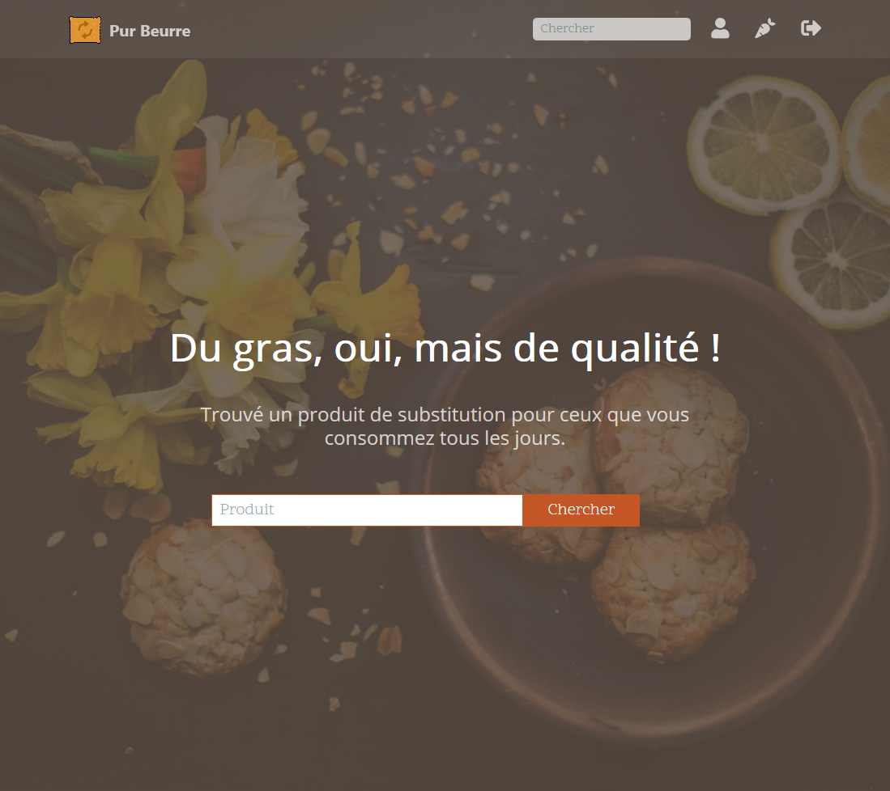

# Pur Beurre

> OpenClassrooms // Application Developer Training - Python // Project 08

>  [Link to the project Management Board](https://github.com/vincenthouillon/purbeurre-app/projects/1)

The startup Pur Beurre, with which you have already worked, wants to develop a web platform for its customers. This site will allow anyone to find a healthy substitute for a food considered "Too fat, too sweet, too salty" (although we all know that fat is life).



## Getting Started
These instructions will get you a copy of the project up and running on your local machine for development and testing purposes.

### Prerequisites

> Python 3, PostgreSQL

### Installing

Clone this repository to your local machine:
```console
git clone https://github.com/vincenthouillon/purbeurre-app.git
```

### Example with '**venv**'

Go to the purbeurre-app folder:

```console
cd purbeurre-app
```

Install dependencies in the virtual environment:

```console
pipenv install
```

To install and activate the virtual environment:
```console
python -m venv venv
python venv\Scripts\activate
pip install -r requirements.txt
```

> [!IMPORTANT]
> Create a database 'purbeurre' in PostgreSQL.

To create the tables in the database:
```console
manage.py makemigrations
manage.py migrate
```

To populate database:

| Windows           | | Unix system               |
|-------------------|-|---------------------------|
| manage.py getdata | | python manage.py getdata  |

To launch the program:

| Windows             | | Unix system                 |
|---------------------|-|-----------------------------|
| manage.py runserver | | python manage.py runserver  |

And open your browser to the following address '**localhost:8000**'.

For disable the virtal environnement, enter:
```console
deactivate
```

## Running the tests

Run tests:

| Windows        | | Unix system            |
|----------------|-|------------------------|
| manage.py test | | python manage.py test  |


## Deployment

> This project is visible on [Heroku](https://hv-purbeurre.herokuapp.com/).

## Built With

* [Python 3.7](https://www.python.org/) - Python is a programming language that lets you work quickly and integrate systems more effectively.
* [Django](https://www.djangoproject.com/) - Django is a high-level Python Web framework that encourages rapid development and clean, pragmatic design. Built by experienced developers, it takes care of much of the hassle of Web development, so you can focus on writing your app without needing to reinvent the wheel. It’s free and open source. 

## API Reference
* [API Open Food Facts](https://fr.openfoodfacts.org/data)


## Authors

* **Vincent Houillon** - *Initial work* - [vincenthouillon](https://github.com/vincenthouillon)

## License

This project is licensed under the MIT License - see the [LICENSE](LICENSE) file for details.

## Acknowledgments

* [OpenClassrooms](https://openclassrooms.com)
